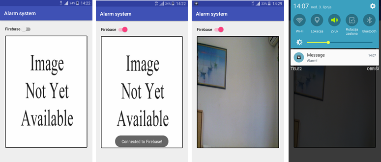

# alarmni-sustav (iotapp+mobapp)
Mobilna aplikacija za primanje dojava alarmnog sustava (zasnovanog na RPi3 i PIR senzoru).

Uz mobile i thing modul, potrebno je dodati i biblioteku za upravljanje web kamerom (https://github.com/openxc/android-webcam, Christopher Peplin).
Također, nakon kreiranje Firebase projekta, dodati google-services.json datoteku u Android Studio projekt na razinu modula (ista datoteka za mobile i thing).

### Autori (2017./2018.)
- **Đuranović Tomislav** (tdjuranov@unipu.hr)
- **Đaić Katarina**	(kdjaic@unipu.hr)

### Organizacija
[Sveučilište Jurja Dobrile u Puli](http://www.unipu.hr/)   
[Fakultet informatike u Puli](https://fipu.unipu.hr/)  
Mobilne aplikacije, Ak.g. 2017./2018.  
Voditelj: **Siniša Sovilj** (ssovilj@unipu.hr)
